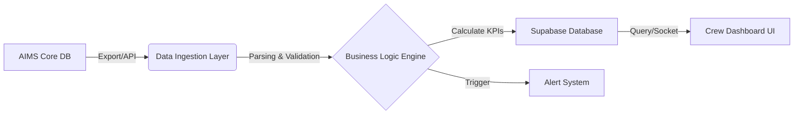

# Technical Specification: Crew Management Dashboard (CMS)

**Version:** 1.0  
**Date:** 20/01/2026  
**Author:** Solution Architect Team  
**Status:** Draft / Active Development  

---

## 1. Tổng Quan (Executive Summary)

**Crew Management Dashboard** là giải pháp phần mềm được xây dựng trên nền tảng **Antigravity**, nhằm cung cấp cái nhìn toàn diện và thời gian thực về hoạt động của phi hành đoàn. Hệ thống tập trung vào việc giám sát giờ bay (**Block Hours**), quản lý hạn mức bay theo quy định (**FDP/Flight Duty Period**), và tối ưu hóa phân bổ nguồn lực.

Mục tiêu cốt lõi:
1.  **Safety & Compliance:** Đảm bảo tuân thủ tuyệt đối các quy định về giới hạn bay và thời gian nghỉ ngơi (**Rest Period**) của Cục Hàng không (CAAV) và tài liệu khai thác mặt đất (OM-A).
2.  **Operational Awareness:** Cung cấp dữ liệu Real-time về trạng thái phi hành đoàn, tàu bay và lịch trình khai thác.
3.  **Efficiency:** Tối ưu hóa việc sử dụng tổ bay thông qua phân tích luân chuyển (**Crew Rotation**) và chỉ số sử dụng (**Utilization**).

---

## 2. Kiến Trúc Hệ Thống & Tích Hợp AIMS (System Architecture)

Hệ thống được thiết kế theo mô hình **Event-Driven Architecture**, cho phép tiếp nhận và xử lý dữ liệu liên tục từ hệ thống lõi AIMS.

### 2.1 Chiến lược tích hợp AIMS (Integration Strategy)

Để đảm bảo tính toàn vẹn và "near real-time" của dữ liệu, Antigravity tích hợp với AIMS thông qua hai cơ chế chính:

*   **Cơ chế 1: AIMS API Gateway (Real-time)**
    *   Hệ thống gọi định kỳ (polling) hoặc nhận Webhook từ AIMS API để cập nhật trạng thái chuyến bay (FLT status), thay đổi tổ bay (Crew positioning).
    *   Định dạng dữ liệu: JSON/XML.

*   **Cơ chế 2: Data Import (Batch Processing - Hiện tại)**
    *   Hỗ trợ import các báo cáo định dạng chuẩn CSV/XML xuất từ AIMS Report Module.
    *   Quy trình: `AIMS Export` -> `Secure Upload` -> `Antigravity Data Parser` -> `Supabase DB`.

### 2.2 Luồng xử lý dữ liệu (Data Pipeline)

---

## 3. Module Dữ liệu Đầu vào (Input Data Schema)

Hệ thống xử lý 4 luồng dữ liệu chính. Dưới đây là đặc tả kỹ thuật cho từng loại dữ liệu.

### 3.1 Flight Operations Data (`DayRepReport`)
Dữ liệu khai thác chuyến bay hàng ngày, dùng để tính toán giờ bay thực tế.

| Field Name | Type | Description | Example |
| :--- | :--- | :--- | :--- |
| **Date** | `Date` | Ngày khai thác (Operating Date) | `15/01/26` |
| **Reg** | `String` | Số đăng bạ tàu bay | `A320` |
| **Flt** | `String` | Số hiệu chuyến bay | `VJ123` |
| **STD** | `Time` | Giờ khởi hành dự kiến (Schedule Time of Departure) | `14:00` |
| **STA** | `Time` | Giờ đến dự kiến (Schedule Time of Arrival) | `16:30` |
| **Crew** | `String` | Danh sách tổ bay kèm vị trí | `-NAM(CP) 1234 -LAN(FO) 5678` |

### 3.2 Aircraft Utilization (`SacutilReport`)
Dữ liệu tổng hợp về hiệu suất sử dụng đội tàu bay.

| Field Name | Type | Description |
| :--- | :--- | :--- |
| **AC Type** | `String` | Loại tàu bay (A320, A321, A330) |
| **Block Hours** | `Time` | Tổng giờ block (Domestic/International) |
| **Cycles** | `Integer` | Số chu kỳ cất/hạ cánh (Flight Cycles) |
| **Avg Util** | `Float` | Hiệu suất sử dụng trung bình ngày |

### 3.3 Crew Limits & Rolling Hours (`RolCrTotReport`)
Dữ liệu theo dõi hạn mức bay tích lũy (Cumulative Block Hours).

| Field Name | Type | Description | Threshold (Warning/Critical) |
| :--- | :--- | :--- | :--- |
| **Crew ID** | `String` | Mã định danh phi hành đoàn | Unique Key |
| **28-Day Block** | `Float` | Tổng giờ bay trong 28 ngày gần nhất | **>85h** (Warn), **>95h** (Crit) |
| **12-Month Block** | `Float` | Tổng giờ bay trong 12 tháng liên tiếp | **>900h** (Warn), **>1000h** (Crit) |

---

## 4. Module Logic Tính toán (Business Logic)

> [!IMPORTANT]
> **Operating Day Rule:** Trong hàng không, ngày khai thác không trùng với ngày dương lịch thông thường. Hệ thống áp dụng quy tắc **04:00 Cut-off**.

### 4.1 Quy tắc ngày khai thác (Operating Day Processing)
Hệ thống Antigravity tự động chuẩn hóa ngày dựa trên giờ khởi hành (STD):

*   **Quy tắc:** Một ngày khai thác được tính từ **04:00 LT (Local Time)** của ngày hiện tại đến **03:59 LT** của ngày hôm sau.
*   **Logic xử lý:**
    *   Nếu `STD >= 04:00`: Chuyến bay thuộc ngày dương lịch hiện tại.
    *   Nếu `00:00 <= STD < 04:00`: Chuyến bay được tính thuộc về **ngày hôm trước**.
    *   *Ví dụ: Chuyến bay khởi hành lúc 02:30 ngày 16/01 sẽ được ghi nhận vào báo cáo ngày 15/01.*

### 4.2 Tính toán Block Time
Block Time được tính từ lúc tàu bay rút chèn (Off-block) đến lúc đóng chèn (On-block).
Công thức (dựa trên Schedule):
$$ BlockTime = STA - STD $$
*Lưu ý: Nếu BlockTime < 0 (qua đêm), hệ thống tự động cộng thêm 24h.*

### 4.3 Logic nhận diện tổ bay (Crew Group Rotation)
Để theo dõi sự luân chuyển của phi hành đoàn (tránh phân mảnh dữ liệu):
1.  Hệ thống trích xuất danh sách Crew ID từ chuỗi dữ liệu (ví dụ: `CP-123, FO-456, PU-789`).
2.  Tạo **Hash Key** duy nhất cho nhóm phi hành đoàn này.
3.  Theo dõi nhóm này khi họ di chuyển qua các tàu bay (REG) khác nhau trong cùng một ngày làm việc.

---

## 5. UI/UX & Giao diện Hiển thị (Dashboard Design)

Giao diện người dùng được tối ưu hóa cho **Operational Control Center (OCC)** với tông màu Dark Mode để giảm mỏi mắt khi theo dõi liên tục.

### 5.1 Các thành phần chính (Key Widgets)

1.  **Executive Summary Cards:**
    *   Hiển thị các chỉ số KPI: Tổng số chuyến bay, Tổng Block Hours, Số lượng tàu bay Active.
    *   Sparkline charts thể hiện xu hướng 7 ngày.

2.  **Crew Status Heatmap (Biểu đồ nhiệt trạng thái):**
    *   Một lưới visual thể hiện trạng thái của toàn bộ phi hành đoàn.
    *   **Màu sắc quy định:**
        *   🟢 Green: Active / Normal.
        *   🟡 Yellow: Standby (SBY).
        *   🔴 Red: Sick (SL), Fatigue, hoặc vượt giới hạn bay.
        *   ⚪ Grey: Day Off.

3.  **Aircraft Utilization Table:**
    *   Bảng thống kê hiệu suất tàu bay, hỗ trợ Filter theo đội bay (Fleet), loại tàu (Type).
    *   Cảnh báo nếu Utilization quá thấp hoặc quá cao so với định mức (Benchmark).

### 5.2 Luồng tương tác (User Flow)
1.  **Upload/Sync:** Người dùng upload CSV hoặc kích hoạt Sync từ AIMS.
2.  **Validate:** Hệ thống hiển thị Preview và báo lỗi định dạng (nếu có).
3.  **Monitor:** Dashboard tự động refresh, hiển thị các cảnh báo (Alerts) lên đầu trang.
4.  **Drill-down:** Click vào một Crew ID hoặc AC Reg để xem lịch sử chi tiết (Traceability).

---

## 6. Hệ thống Cảnh báo An toàn (Safety & Alert System)

Hệ thống tích hợp module giám sát tuân thủ (Compliance Matrix) để đưa ra cảnh báo sớm.

### 6.1 Ma trận cảnh báo (Alert Matrix)

| Loại cảnh báo | Điều kiện kích hoạt (Trigger Logic) | Mức độ | Hành động khuyến nghị |
| :--- | :--- | :--- | :--- |
| **Max Block Hours (28-day)** | Tổng giờ bay 28 ngày > **85h** | ⚠️ Warning | Hạn chế xếp lịch bay dài |
| **Max Block Hours (28-day)** | Tổng giờ bay 28 ngày > **95h** | ⛔ Critical | **Dừng bay ngay lập tức (Stop Flight)** |
| **Fatigue Risk** | Báo cáo mệt mỏi (Fatigue Report) | 🔴 High | Yêu cầu nghỉ ngơi bắt buộc (Mandatory Rest) |
| **Sick Call Spike** | Tỷ lệ báo ốm > 5% / ngày | 🟠 Medium | Kích hoạt phi công dự bị (Activate Standby) |

> [!WARNING]
> **Quy tắc An toàn Bay:** Mọi cảnh báo mức **Critical** đều yêu cầu xác nhận (Acknowledge) từ quản lý trực ca trước khi phi hành đoàn được phép thực hiện nhiệm vụ tiếp theo.

### 6.2 Cơ chế thông báo (Notification Channel)
*   **On-screen:** Popup cảnh báo đỏ nhấp nháy trên Dashboard.
*   **Email/SMS:** Gửi tự động đến bộ phận Crew Scheduling cho các cảnh báo Critical.

---

*Tài liệu này dùng cho mục đích phát triển nội bộ và tích hợp hệ thống Antigravity cho Hãng hàng không.*
